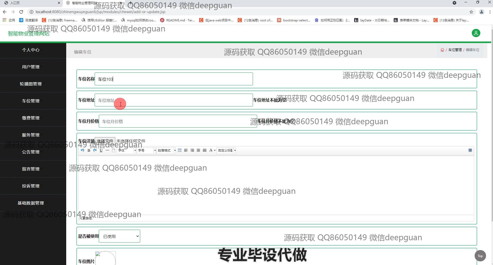
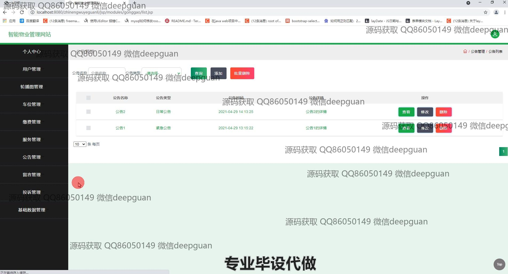
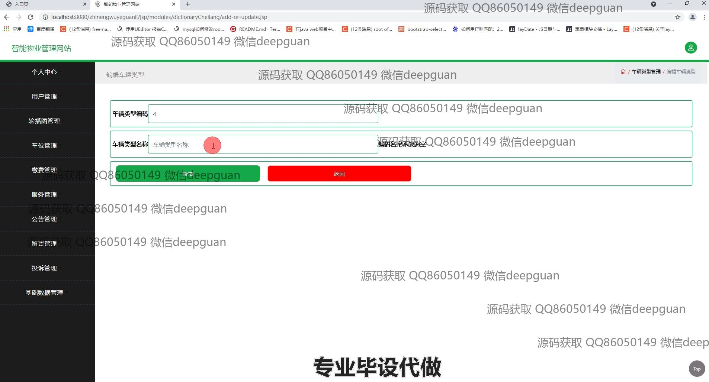

<h1 align="center">物业管理</h1>

## 简介
智能物业管理系统：集成物业信息管理、用户管理、车位管理、缴费管理和投诉管理，为用户提供高效的物管服务和全面的功能导航。    --计算机毕业设计源码；毕设源码；java毕业设计源码

## 联系方式

<h3 align="center">获取完整代码与数据库文件 + 微信：deepguan QQ: 86050149 QQ群: 783742310</h3>

<h3 align="center">可帮忙远程部署 包运行成功！提供远程部署、修改代码、设计文档指导、代码讲解等服务！</h3>

## 功能介绍（完整见运行截图）
管理员：支持登录、注册、退出操作，可通过导航栏管理模块切换功能，包括用户信息管理、房屋管理、车辆管理、车位管理、缴费管理等。提供用户性别统计和公告管理功能，可编辑、查看和删除用户信息、房屋、车位及公告详情。支持多维度查询与批量操作，包括筛选投诉和服务信息。通过数据分页功能，便捷处理大规模信息。页面含详细日志与记录管理，提升整体管理效率。

用户：支持注册、登录、退出，可通过个人中心查看和编辑个人信息，包括手机号、身份证号、性别及照片上传等。可申请和管理车位订单，查询缴费记录并上传缴费凭证。支持投诉和留言功能，附带上传照片、填写投诉详情、选择投诉类型等选项。用户中心提供车辆、房屋等资源信息查看与编辑功能，实现自助式物业服务管理。

业主：可在线编辑车位信息，包括车位名称、地址、价格及详细描述等，支持上传图片及状态选择。管理个人车位订单，查看订单状态并进行审核。可通过系统提交服务申请、编辑服务详情，并上传相关文件或备注。支持筛选、搜索功能，提升使用便捷性，同时通过导航栏快速访问房屋管理、公告及其他模块。

访客：提供注册入口及查看公告功能，通过首页导航了解物业服务模块。可浏览平台提供的物业信息，包括车位、服务、公告详情。支持使用搜索功能快速获取所需信息，方便操作。

## 运行截图

本代码来源于网络,仅供学习参考使用!

